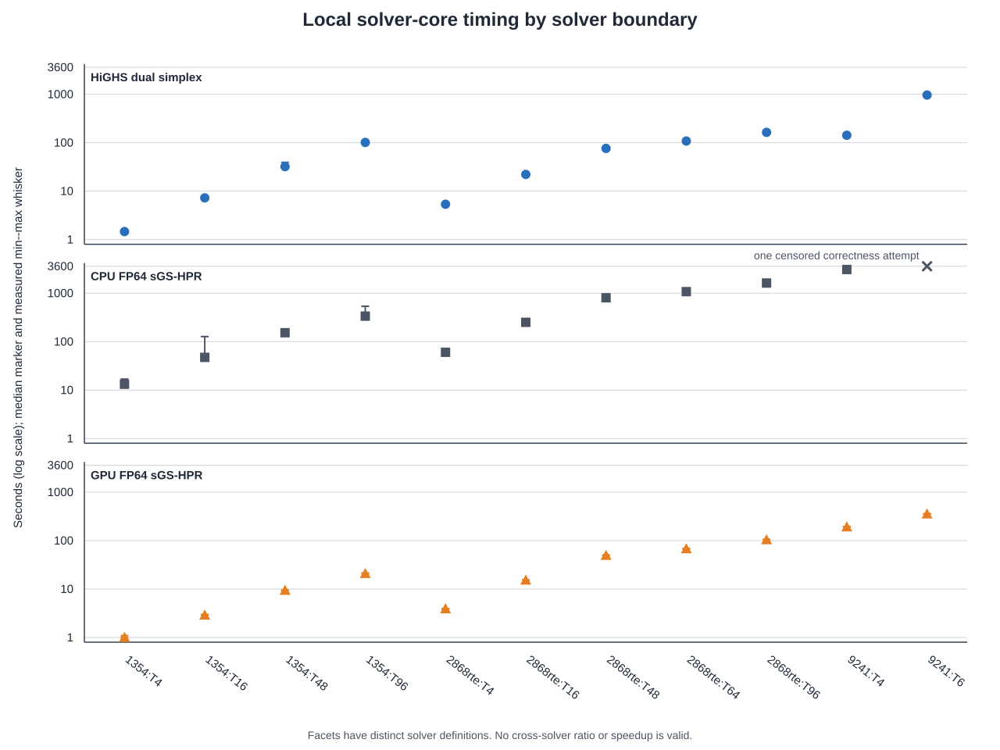
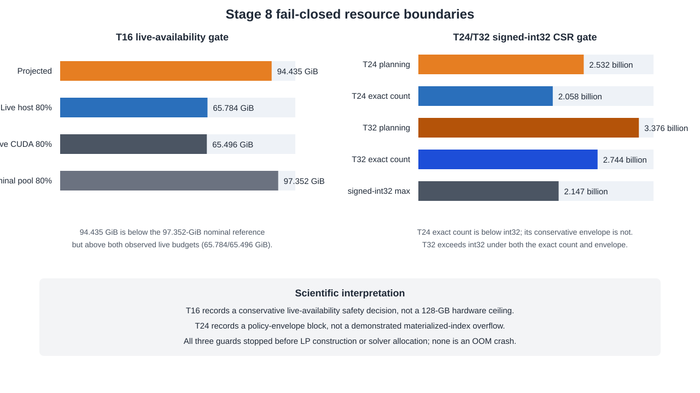

# Reproducing a GPU-Based sGS-HPR Solver for Large-Scale Multi-Period DC Optimal Power Flow

**An evidence-bounded structural reproduction on NVIDIA DGX Spark**

Thomas DiGregorio
Independent Reproduction Study
August 5, 2026

> **Final classification: D - structural reproduction**
>
> Stages 0--7: PASS. Stage 8: FAIL under its frozen all-track acceptance
> contract. Stage 8 protocol checker: PASS, 12/12. GPU-only sequence 6--8
> continuation: `COMPLETE_WITH_RESOURCE_LIMITS`; checker PASS, 13/13.
> Stage 10: LOCKED.

## Abstract

This work reproduces the mathematical and computational structure of the
symmetric Gauss-Seidel Halpern-accelerated proximal-reflection (sGS-HPR)
method reported by Wang *et al.* for large-scale multi-period DC optimal power
flow (DCOPF). The study reconstructs the canonical linear program, implements
the paper-order dual updates, independently checks the residual mapping and
stopping rules, corrects a sign inconsistency in the printed structural
equality inverse, builds an FP64 CPU oracle, and ports the validated path to an
NVIDIA DGX Spark. The GPU path proves low-level cuSPARSE CSR ALG2 selection,
resident iterative state, and trajectory parity with the CPU implementation.

Public MATPOWER networks and deterministic renewable/storage policies were
then used to reconstruct all 18 rows of the paper's principal benchmark table.
All 18 reproduced row and variable dimensions match the publication, but none
of the sparse nonzero counts match because the authors' modified instances and
construction pipeline are unavailable. Six Stage 7 rows passed HiGHS, CPU
FP64, GPU FP64, numerical, physical, provenance, and repeated-timing gates.
Stage 8 added four fully passing large rows. On `case9241pegase:T6`, HiGHS and
GPU FP64 passed, while the required CPU FP64 correctness solve exceeded the
frozen 3,600-second deadline. The remaining requested rows were resolved
without allocation: T16 exceeded both live unified-memory budgets, and T24/T32
exceeded signed-int32 CSR planning capacity.

The result is therefore **D - structural reproduction**, not an exact,
near-exact, or controlled performance reproduction. The study reproduces the
algorithmic structure and validates a working FP64 GPU implementation, while
preserving the unavailable-data boundary, the Stage 8 failure, and the
preallocation safety limits as scientific results.

**Keywords:** DC optimal power flow, Halpern iteration, proximal reflection,
symmetric Gauss-Seidel decomposition, GPU sparse linear algebra,
reproducibility, DGX Spark.

## 1. Research question and principal result

The research question was not merely whether a GPU program could solve a
related DCOPF. It was whether the paper's mathematical route could be rebuilt,
checked against independent oracles, ported without changing the algorithmic
path, and scaled transparently enough to distinguish successful reproduction
from reconstruction or resource limitation.

The answer has three parts:

1. **Mathematics and implementation were reproduced.** The canonical LP,
   Algorithm 2 update order, Equation (28) KKT mapping, Equation (54) stopping
   tests, structural equality formula, preconditioning, control policy, CPU
   reference, and resident FP64 GPU path all have independent checks.
2. **The published numerical instances were not reproduced.** Public-network
   reconstructions match every published row and variable dimension but differ
   in every sparse nonzero count. Missing placements, profiles, parameters,
   PTDF choices, and source code prevent author-instance identity.
3. **The full large-scale acceptance campaign did not pass.** Four Stage 8
   rows passed. The fifth failed when its required CPU correctness track timed
   out; later rows were safely stopped by memory and index guards. A protocol
   checker PASS verifies honest execution and evidence preservation; it does
   not convert that outcome into a scientific PASS.

These findings jointly satisfy the frozen definition of a structural
reproduction.

## 2. Source paper summary

The reproduced source is *An Efficient GPU-based Halpern Accelerating
Algorithm for Large-scale DC Optimal Power Flow* by Qi Wang, Guojun Zhang, Yue
Yang, Chao Ren, Wenchuan Wu, Xinyuan Zhao, Mikael Skoglund, and Defeng Sun,
DOI `10.1109/TPWRS.2025.3635652`. The supplied 17-page PDF is preserved with
SHA-256
`7e9791646401e11bfddf9ebed6bd94491ed0b592744581edd851ddbf5e20dba4`.

The paper writes a multi-period base-case DCOPF as a box-constrained LP,
applies HPR to its dual, and exploits the equality/inequality partition with a
symmetric Gauss-Seidel sweep. The equality block admits a diagonal plus
low-rank solution; the inequality multiplier update is a projected step based
on a spectral proximal operator. The authors prove an `O(1/k)` non-ergodic KKT
residual bound and report an overall large-system complexity summarized as
`O(N_L n / epsilon)`. Their experiments use an NVIDIA A100-SXM4-80GB, CUDA
12.3, CSR storage, and cuSPARSE CSR ALG2; Gurobi 12.0 runs on a separate Intel
i9-14900HX workstation with 96 GB memory.

The publication calls the application security-constrained, but its displayed
model contains no outage or contingency index. This reproduction therefore
treats Equations (1)--(16) as base-case multi-period DCOPF. N-1 SCOPF is a
separate, explicitly locked research extension.

## 3. Mathematical formulation

### 3.1 Canonical primal and dual

The implementation contract is the paper's canonical LP

\[
\begin{aligned}
\min_{x\in\mathbb{R}^{n}}\quad & c^{\mathsf T}x,\\
\text{subject to}\quad & A_1x=b_1,\\
&A_2x\ge b_2,\\
&\ell\le x\le u,
\end{aligned}
\]

with `A = [A1; A2]`, `b = [b1; b2]`, box `C = [l,u]`, and multiplier set
`D = R^{m1} x R_+^{m2}`. Its dual is

\[
\min_{y,z}\ -b^{\mathsf T}y+\delta_D(y)+\delta_C^*(-z)
\quad\text{subject to}\quad A^{\mathsf T}y+z=c.
\]

The reconstructed decision order is

\[
x=(p_G,p_{RG},p_{ESS}^{dc},p_{ESS}^{ch},r^u,r^d).
\]

For `T` periods, `N_L` constrained lines, `N_G` conventional generators,
`N_RG` renewable generators, and `N_ESS` storage devices, the table-consistent
dimensions are

\[
n=T(3N_G+N_{RG}+2N_{ESS}),
\]

\[
m_1=T+N_{ESS},\qquad
m_2=2TN_L+(4T-2)N_G+2TN_{ESS}+2T.
\]

The row families represent power balance and terminal storage energy as
equalities; two-sided branch flow, generator headroom/footroom, reserve,
ramping, and storage-energy limits as split inequalities; and the remaining
device limits as box bounds.

### 3.2 KKT and stopping maps

The full KKT residual mapping is

\[
\mathcal{R}(y,z,x)=
\begin{pmatrix}
y-\Pi_D(y-Ax+b)\\
x-\Pi_C(x-z)\\
c-A^{\mathsf T}y-z
\end{pmatrix}.
\]

The paper's stopping rule separately normalizes primal feasibility, box
normal-cone consistency, and stationarity. This distinction matters: the first
Equation (54) block is not the entire Equation (28) KKT map. Every accepted
candidate passed all three normalized blocks at `5e-5`, the additional raw KKT
gate at `0.01`, original-space physical violations at `0.01 MW/MWh`, and the
scaled objective gap to HiGHS at `2e-4`.

## 4. Implemented algorithm

For `w = (y1,y2,z,x)`, the FP64 solver follows the printed Algorithm 2 order:

1. Compute the box-proximal `z` update and the equivalent projected primal
   point
   \[
   \bar x^{k+1}=\Pi_C\!\left[x^k+\sigma(A^{\mathsf T}y^k-c)\right].
   \]
2. Solve the first equality-multiplier system for
   `y1^(k+1/2)` using `y2^k`.
3. Project the inequality multiplier with
   \[
   \bar y_2^{k+1}=\Pi_{\mathbb{R}_+^{m_2}}
   \left[y_2^k+\lambda^{-1}(b_2/\sigma-A_2R_y)\right],
   \]
   where `lambda` safely bounds `||A2||_2^2`.
4. Solve the second equality system for `y1^(k+1)` using the new
   `y2^(k+1)`. Both equality sweeps are required.
5. Reflect the proximal point,
   `hat(w)^(k+1) = 2 bar(w)^(k+1) - w^k`.
6. Apply the fixed-anchor Halpern update
   \[
   w^{k+1}=\frac{1}{k+2}w^0+\frac{k+1}{k+2}\hat w^{k+1}.
   \]

Ten reversible Ruiz passes, one Pock-Chambolle diagonal step with alpha one,
and full-vector `b`/`c` normalization precede production solves. The paper does
not publish its exact adaptive-penalty and restart code. The implementation
therefore transfers published HPR-LP rules at the manuscript's 100-iteration
cadence and labels that choice as a sourced reconstruction, not author-code
identity.

## 5. Derivation verification

The derivation was checked in increasing-risk layers rather than accepted from
the manuscript by inspection.

### 5.1 Projection and residual identities

Analytic toy LPs verified box projection, nonnegative multiplier projection,
the combined `z`/`x` identity, the full KKT map, and the separate stopping
blocks. Independent SciPy HiGHS solves established objective and multiplier
sign references.

### 5.2 Equality structure and manuscript correction

For the paper's explicit equality matrix, `A1 A1^T` has diagonal blocks and a
rank-one coupling. Eliminating the storage block produces

\[
(D_1-\alpha\mathbf{1}\mathbf{1}^{\mathsf T})y_{11}=\widetilde R_{11}.
\]

The manuscript prints a Woodbury expression with the sign pattern for a *plus*
rank-one update. The direct linear-system oracle rejects that expression. The
implemented inverse uses the correct minus-update identity

\[
(D_1-\alpha uu^{\mathsf T})^{-1}
=D_1^{-1}+
\frac{D_1^{-1}uu^{\mathsf T}D_1^{-1}}
{\alpha^{-1}-u^{\mathsf T}D_1^{-1}u},
\]

and matches Cholesky in FP64. Stage 4's independent checker passed 20/20
checks. This is a documented correction, not a hidden deviation.

### 5.3 Spectral and trajectory checks

Dense eigendecomposition was the small-case authority for the `y2` proximal
parameter. Sparse `eigsh` and seeded power iteration cross-checked the estimate
before a positive safety margin was applied. CPU/GPU comparisons then tested
intermediate state trajectories, not only final objectives. At 1, 10, and 100
iterations, worst recovered-state relative errors remained far inside the
locked parity tolerances; both full-policy cases stopped at the same iteration
and reproduced the same policy-event schedule.

## 6. Experimental environment

The accepted GPU evidence was generated in a clean, detached DGX worktree with
the executed source manifest preserved. The principal environment is:

| Item | Reproduction environment | Paper environment |
|---|---|---|
| GPU | NVIDIA GB10, integrated | NVIDIA A100-SXM4-80GB |
| Compute capability | 12.1 | not reported |
| Unified/global memory | 130,663,165,952 bytes (121.69 GiB) | 80 GB GPU memory |
| CPU architecture | Linux/aarch64 | GPU host not specified |
| OS | Ubuntu 24.04.4 / Linux 6.17.0-1029-nvidia | not specified |
| Python | 3.12.3 | not specified |
| NumPy / SciPy | 2.3.5 / 1.16.3 | not specified |
| CuPy | 14.1.1 (`cupy-cuda13x`) | not reported |
| CUDA driver/runtime API | 13.0 / 13.2 | CUDA 12.3 |
| Sparse format/index | CSR / signed int32 | CSR; index width not stated |
| Gurobi | unavailable, optional locally | 12.0 on separate i9-14900HX host |

Hardware differences alone preclude an exact timing reproduction.

## 7. CPU implementation

The CPU implementation is the readable numerical oracle. It uses SciPy sparse
operators, FP64 state, explicit projections, the exact paper update order, and
both direct and paper-structural equality backends. All recovered candidates
are assessed in original coordinates; scaling never relaxes a physical or KKT
gate. The CPU implementation also provides fixed-horizon trajectories for GPU
parity, policy event logs, and a deliberately independent residual path.

CPU work on the DGX is scientifically necessary even in a GPU study: model
assembly, reference validation, policy bookkeeping, and an independent oracle
cannot be inferred from GPU success. Stage 8 additionally required CPU FP64 as
a gating track. That frozen design is why the T6 CPU timeout is a Stage 8
failure even though its GPU candidate passed. The later user-authorized
sequence 6--8 continuation explicitly skipped CPU but did not revise or erase
the original contract.

## 8. GPU implementation

The GPU path uses CuPy arrays and sparse matrices in FP64. `A1`, `A2`, their
transposes, scaling vectors, state, and reusable workspaces remain device
resident. A phase-labeled transfer ledger permits setup, scalar diagnostics,
policy checks, and final recovery while rejecting an unexpected full-state
copy inside the iteration loop.

The implementation does not infer kernel selection from a high-level API. A
low-level descriptor records `CUSPARSE_SPMV_CSR_ALG2` (enum 3 under pinned
CuPy 14.1.1), and an exact probe verifies both normal and transpose products.
The largest Stage 6 CPU/GPU sparse-operator error was `2.22045e-16`. Full
FP64 policy solves agreed in objective to approximately `1.82e-11` absolute.

FP32 was tested only after FP64 passed and remained non-gating. It produced
finite runs but missed the frozen FP64 trajectory tolerance, so this report
does not present reduced precision as an equivalent implementation.

## 9. Validation design and results

### 9.1 Frozen acceptance gates

| Gate | Threshold | Largest accepted observation | Result |
|---|---:|---:|---|
| Normalized primal block | `5e-5` | `2.01695e-8` | PASS |
| Normalized stationarity block | `5e-5` | `9.65930e-6` | PASS |
| Normalized box block | `5e-5` | `8.83057e-13` | PASS |
| Raw KKT norm | `0.01` | `0.0096347433` | PASS |
| Physical violation | `0.01 MW/MWh` | `0.0063110950` | PASS |
| Scaled objective gap to HiGHS | `2e-4` | `4.28499e-8` | PASS |
| Per-solve deadline | `3,600 s` | T6 CPU `3,600.092739 s` | FAIL for that track |

The largest observations cover completed Stage 7--8 candidates. The T6 CPU
attempt produced no accepted candidate and is represented only by its timeout.

### 9.2 Independent checker ledger

| Scope | Scientific result | Checker result | Interpretation |
|---|---|---:|---|
| Stages 0--7 | PASS at each stage | 120/120 combined checks PASS | Accepted evidence chain |
| Stage 8 strict campaign | **FAIL** | 12/12 PASS | Protocol valid; required T6 CPU track timed out |
| Stage 8 GPU-only continuation | `COMPLETE_WITH_RESOURCE_LIMITS` | 13/13 PASS | T16/T24/T32 resolved without allocation |

The generated ledger and evidence hashes are in
`results/tables/stage_9_stage_checks.csv` and
`results/stage_9_result_index.json`.

## 10. Benchmark results

All timings below are local solver-core medians from five measured repetitions
after a separate correctness solve and warm-up. A dash means no accepted
measurement exists.

| Stage | Reconstruction | m | n | nnz(A) | HiGHS s | CPU FP64 s | GPU FP64 s | Row result |
|---:|---|---:|---:|---:|---:|---:|---:|---|
| 7 | case1354 T4 | 20,192 | 4,208 | 4,799,808 | 1.463 | 13.190 | 1.013 | PASS |
| 7 | case1354 T16 | 82,124 | 16,832 | 19,228,464 | 7.265 | 47.399 | 2.924 | PASS |
| 7 | case1354 T48 | 247,276 | 50,496 | 57,896,368 | 32.095 | 153.046 | 9.481 | PASS |
| 7 | case1354 T96 | 495,004 | 100,992 | 116,420,464 | 101.242 | 336.657 | 21.084 | PASS |
| 7 | case2868 T4 | 40,163 | 9,488 | 19,073,056 | 5.366 | 60.350 | 3.939 | PASS |
| 7 | case2868 T16 | 163,823 | 37,952 | 76,354,336 | 22.138 | 250.601 | 15.408 | PASS |
| 8 | case2868 T48 | 493,583 | 113,856 | 229,507,104 | 76.239 | 804.863 | 49.968 | PASS |
| 8 | case2868 T64 | 658,463 | 151,808 | 306,303,136 | 108.232 | 1,078.892 | 68.383 | PASS |
| 8 | case2868 T96 | 988,223 | 227,712 | 460,334,496 | 163.593 | 1,621.905 | 105.022 | PASS |
| 8 | case9241 T4 | 152,774 | 24,700 | 342,863,272 | 142.479 | 3,087.218 | 193.632 | PASS |
| 8 | case9241 T6 | 230,376 | 37,050 | 514,308,838 | 963.957 | timeout | 357.544 | **FAIL** |



The GPU completed and validated all 11 allocated benchmark rows. The CPU
completed 10; its T6 correctness attempt timed out before a warm-up or timing
median. Stage 8's fully passing prefix is therefore four rows.

No speedup is claimed. The local CPU and GPU timing boundaries are not
identical, the reconstruction's sparse support differs from the publication,
the paper's precise inclusion boundary is under-specified, and GB10 is not
A100. Ratios would mix algorithm, implementation, data, and hardware effects.

## 11. Timing decomposition

Stage 6 froze named timing boundaries before the larger campaigns. The complete
diagnostic recorded:

| Boundary | Seconds | Measurement rule |
|---|---:|---|
| CUDA initialization | 0.404647 | host clock; final device synchronization |
| CPU construction and preprocessing | 0.008021 | host monotonic clock |
| First-run compilation and warm-up | 0.010213 | synchronized completed one-step GPU run |
| Allocation | included | part of GPU solver initialization |
| Host-to-device transfer | 0.004171 | synchronized explicit transfers |
| GPU solver initialization | 0.074478 | host clock; includes allocation |
| Resident iteration loops | 1.828999 | CUDA events; two 1,000-step diagnostics |
| Residual checks | 0.008027 | CUDA events nested inside loop time |
| Device-to-host transfer | 0.024864 | synchronized explicit transfers |
| Complete Stage 6 wall time | 6.716848 | monotonic host clock around runner |

Nested residual time must not be added to loop time. Stage 7--8 medians use a
solver-specific prepared-workspace boundary recorded in every track, while
case construction and preprocessing remain separately reported. This explicit
decomposition makes the evidence auditable but not automatically comparable
to the paper's undocumented stopwatch boundary.

## 12. Memory and resource results

DGX Spark exposes one physical memory pool to CPU and integrated GPU. The
runner therefore budgets projected host assembly plus GPU planning memory once
as a unified peak and requires that projection to fit within both 80% of live
host-available pages and 80% of CUDA-free memory. The smaller live budget is
decisive; the nominal 128 GB product capacity is not a safe allocation budget.

| Sequence | Row | Unified projection GiB | Host budget GiB | CUDA budget GiB | Outcome |
|---:|---|---:|---:|---:|---|
| 1 | case2868 T48 | 24.114 | 82.657 | 82.367 | PASS |
| 2 | case2868 T64 | 32.169 | 80.811 | 80.522 | PASS |
| 3 | case2868 T96 | 48.303 | 80.447 | 80.157 | PASS |
| 4 | case9241 T4 | 23.606 | 79.659 | 79.255 | PASS |
| 5 | case9241 T6 | 35.410 | 79.413 | 79.124 | allocated; CPU timeout |
| 6 | case9241 T16 | 94.435 | 65.784 | 65.496 | `MEMORY_BLOCKED` |

T24 and T32 were blocked even earlier by CSR index capacity. Their conservative
planning counts were 2,531,600,260 and 3,375,704,460 nonzeros, both above the
signed-int32 maximum 2,147,483,647. No LP construction, HiGHS call, CPU call,
GPU call, or Gurobi call occurred for T16, T24, or T32.



The maximum cumulative process-lifetime host high-water mark during the strict
campaign was 95.375 GiB at T6. It is not labeled as an isolated solve peak.
CUDA snapshots bracket solves but likewise do not expose a true per-solve GPU
high-water mark through this backend.

## 13. Differences from the paper

### 13.1 What matches

- Canonical LP signs, variables, constraint families, and all 18 published
  `(m,n)` pairs.
- Printed Algorithm 2 update order and fixed-anchor Halpern weights.
- Equation (54) tolerance `5e-5`, ten Ruiz passes, Pock-Chambolle alpha one,
  initial sigma one, 100-iteration policy cadence, CSR storage, and requested
  CSR ALG2 kernel path.
- FP64 CPU/GPU trajectories and accepted original-space numerical checks.

### 13.2 Missing source information and reconstructed identity

- Renewable and storage placement, profiles, reserves, ramps, device
  parameters, and costs.
- PTDF reference and sparse support choices.
- Adaptive penalty and restart implementation, sourced from HPR-LP because the
  manuscript omits its exact rules.
- Public-network matrices: all 18 nonzero counts differ from Table II. The
  differences range from approximately -8.14% to -36.66% for the reported
  reconstructions.
- Local GB10 hardware, software stack, and timing boundary.

### 13.3 Manuscript ambiguities retained as errata

- Equation (55) and Table II imply `m1 = T + N_ESS`, while Appendix A prose
  implies `T(1 + N_ESS)`.
- The printed rank-one inverse has a sign inconsistent with its own Schur
  complement.
- The relative objective-error denominator and reason for variation across
  purportedly deterministic runs are not specified.
- Precision, spectral-estimation safeguards, PTDF sparsification, source
  revisions, and exact timer inclusion rules are not disclosed.
- The security-constrained label is not accompanied by an explicit N-1
  contingency formulation.

## 14. Exact-reproduction classification

| Code | Label | Decision |
|---|---|---|
| A | Exact reproduction | Rejected: author instances, code, hardware, and exact outputs are unavailable. |
| B | Near-exact reproduction | Rejected: every sparse nnz differs and timing is not hardware-controlled. |
| C | Mathematical reproduction | Achieved but incomplete as a final label: the work also reconstructs and executes the benchmark structure. |
| **D** | **Structural reproduction** | **Selected: mathematics, implementation, dimensions, and scaling behavior are reproduced with transparent reconstructed data and resource limits.** |
| E | Partial reproduction | Rejected: the work exceeds an isolated component or incomplete prototype despite the honest Stage 8 failure. |

The classification is not a score averaged over stages. It is an evidence
boundary. Exact instance identity is unavailable, but the work progressed far
beyond a partial implementation: 18 symbolic rows, 11 allocated GPU-validated
rows, 10 CPU-validated rows, full provenance, independent checkers, and
fail-closed resource accounting are all present.

## 15. Limitations

1. **Author-instance identity:** the central limitation is data provenance,
   not a tuning deficit. Matching `m` and `n` does not match sparse work.
2. **Performance attribution:** local timings cannot isolate GPU architecture,
   sparse support, compiler/runtime, algorithm, and timing-boundary effects.
3. **Stage 8 incompleteness:** the strict campaign did not fully validate T6
   because CPU FP64 timed out. No post-hoc exception is introduced.
4. **Resource-bound rows:** T16/T24/T32 establish safe local limits but provide
   no solver correctness or timing observations.
5. **Memory measurement:** available APIs provide allocator snapshots and a
   cumulative host high-water mark, not isolated per-solve peaks.
6. **Control-policy identity:** the adaptive penalty and restart are a sourced
   reconstruction; exact author code remains unknown.
7. **Model boundary:** this is base-case DCOPF. It does not establish N-1
   security performance.

## 16. Recommended next research step

The highest-value next step is **author-instance reconciliation**, not immediate
N-1 expansion. Request or obtain the exact modified MATPOWER cases, time-series
inputs, renewable/storage placement and parameters, matrix-construction code,
precision choice, policy implementation, and timer boundaries. Then run a
small fingerprint gate before any large solve:

1. reproduce exact `m`, `n`, and `nnz(A)` for at least case1354 T4 and
   case2868 T16;
2. match objective and KKT quantities on those small rows;
3. match the paper's timer boundary on equivalent A100-class hardware; and
4. only then classify a near-exact or exact benchmark replication.

If author artifacts remain unavailable, the most useful engineering study is
to remove the signed-int32 CSR ceiling through a verified 64-bit or partitioned
sparse representation and to reduce peak assembly memory without changing the
accepted mathematics. That would be a new scalability study, not a revision of
this reproduction result. Stage 10 N-1 work remains separately locked.

## 17. Conclusion

This project successfully rebuilt and checked the paper's mathematical route
from canonical DCOPF through an FP64 resident-GPU solver. It also identified a
material algebraic sign error, separated stopping tests from full KKT
validation, demonstrated CPU/GPU trajectory parity, and preserved every large
run outcome without weakening a gate. The public reconstructions scale to
hundreds of millions of sparse nonzeros, but they are not the authors'
instances. The large campaign contains a genuine CPU timeout and two distinct
preallocation ceilings.

The scientifically defensible conclusion is therefore **D - structural
reproduction**. It is stronger than a partial port and narrower than a
near-exact replication. That distinction is the main result of Stage 9.

---

# Appendix A. Full evidence ledger

The generated check ledger contains ten independently checked scopes:

- Stage 0: 10/10;
- Stage 1: 6/6;
- Stage 2: 9/9;
- Stage 3: 12/12;
- Stage 4: 20/20;
- Stage 5: 23/23;
- Stage 6: 21/21;
- Stage 7: 19/19;
- Stage 8 strict protocol: 12/12; and
- Stage 8 continuation: 13/13.

The exact paths and SHA-256 values are indexed in
`results/stage_9_result_index.json`. Earlier checker totals establish evidence
integrity; their sum is not a substitute for the separate stage decisions.

# Appendix B. Structural reconciliation

The complete 18-row table is
`results/tables/stage_9_structural_reconciliation.csv`. Every row has exact
published/reproduced `m` and `n`; zero rows have matching `nnz(A)`; and zero
rows are marked timing-comparable with the paper. Counts for unallocated large
rows are symbolic/count-only values and are not presented as materialized LPs.

# Appendix C. Reproducibility checklist

The durable checklist is [reproducibility_checklist.md](reproducibility_checklist.md).
It covers paper identity, data provenance, mathematical checks, power-system
validation, CPU/GPU parity, benchmark protocol, reporting QA, and the locked
Stage 10 boundary.

# Appendix D. Commands to regenerate tables and run tests

The complete command index is [regeneration_commands.md](regeneration_commands.md).
The central deterministic command is:

```powershell
python scripts/generate_stage_9_artifacts.py
```

The complete test commands are:

```powershell
python scripts/check_stage_9.py --output results/raw/stage_9/stage_9_checks.json
python -m pytest -q
python -m ruff check .
python -m ruff format --check .
Set-Location dashboard
npm test
npm run lint
Set-Location ..
```

# Appendix E. Machine-readable result index

`results/stage_9_result_index.json` records:

- paper identity and DOI;
- final A--E classification;
- all stage/checker decisions;
- Stage 8 failure and continuation semantics;
- benchmark coverage totals;
- environment and frozen gates;
- SHA-256 values for source evidence, generated tables, and figures; and
- the explicit Stage 10 lock.

# Appendix F. Final Git status

A Git commit cannot contain its own identifier without changing that
identifier. The final repository handoff therefore records the tested source
HEAD in the machine index and verifies the final commit externally with:

```powershell
git diff --check
git status --short
git rev-parse HEAD
git log -1 --format=fuller
```

The completed handoff requires no output from `git status --short`. The final
commit and push result accompany the Stage 9 completion notice.

# References

1. Q. Wang *et al.*, "An Efficient GPU-based Halpern Accelerating Algorithm
   for Large-scale DC Optimal Power Flow," *IEEE Transactions on Power
   Systems*, vol. 41, no. 3, pp. 2187--2204, 2026,
   doi:10.1109/TPWRS.2025.3635652.
2. R. D. Zimmerman, C. E. Murillo-Sanchez, and R. J. Thomas, "MATPOWER:
   Steady-State Operations, Planning, and Analysis Tools for Power Systems
   Research and Education," *IEEE Transactions on Power Systems*, vol. 26,
   no. 1, pp. 12--19, 2011.
3. Q. Huangfu and J. A. J. Hall, "Parallelizing the dual revised simplex
   method," *Mathematical Programming Computation*, vol. 10, pp. 119--142,
   2018.
4. The complete related-work and source-provenance notes used by this study
   are preserved in `docs/paper_specification.md` and
   `docs/reproduction_limits.md`.
